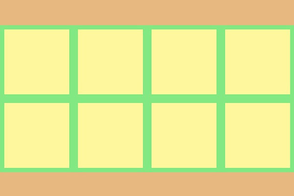

# Flexbox Samples

Flexbox Samples is an open source project designed to learn and improve the operation of the Flexbox layout. We try to have different examples to understand this paradigm and we are even flexible to add your own sample! Are you in?

## Samples

* **Hello World:** It is the simplest example, it has been designed as proof of concept for scaffolding  the project. It consists of a parent container (Flexbox) centered horizontally and vertically. The childs are simple boxes.

* **Dual Player:** This example is intended as a full screen player of two conventional video elements. For example, it can be useful for a video call.

## License
MIT
